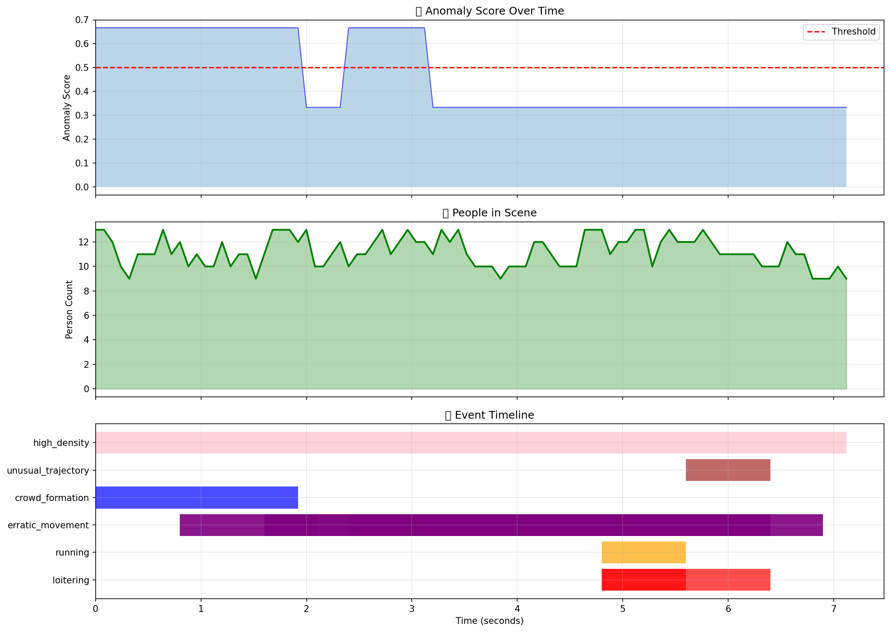

# NeuroVision: Real-Time CCTV Anomaly Detection

A deep-learning surveillance system that detects unusual human behavior in CCTV footage in real time, using YOLOv8 object detection, SORT multi-object tracking, and a layered rule-based + ML anomaly engine.

> **This is a public showcase repository.** It contains the project report, presentation, demo videos, and sample event logs. The source code is maintained in a separate private repository.

---

## Demo Videos

| Scene | Video |
|-------|-------|
| Custom test footage | [demo/Video1_annotated.mp4](demo/Video1_annotated.mp4) |
| UCSD Ped2 benchmark | [demo/ucsd_ped2_test01_annotated.mp4](demo/ucsd_ped2_test01_annotated.mp4) |

Annotated videos show:
- Green bounding boxes around tracked persons
- Stable track IDs across frames
- Live person count + event counter overlay
- Red "ANOMALY DETECTED" banner when rules fire

## Anomaly Timeline



---

## What the System Detects

### Motion-based (per person)
- **Loitering** – staying in a small area too long
- **Running** – unusual speed
- **Erratic Movement** – frequent direction changes
- **Unusual Trajectory** – non-straight paths
- **Freezing / Sudden Stop** – abrupt drop from movement to rest
- **Slow Movement** – sustained low speed
- **Oscillating Movement** – back-and-forth pattern in a confined area

### Crowd-level
- **Crowd Formation** – sudden gathering
- **High Density** – too many people in view
- **Panic** – high speed + low directional coherence (people scatter)
- **Stampede** – high speed + high directional coherence (people flee one way)

### Multi-person interactions
- **Following Behavior** – time-lagged trajectory similarity at follow-distance
- **Group Gathering** – unexpected dense clusters
- **Theft Suspected** – brief close interaction followed by rapid departure
- **Queue Jumping** – sudden positional gain in a detected queue

### Zone-based
- **Restricted Zone Entry**
- **Wrong Direction** in pathway zones
- **Exit Blocking** by stationary people

### Object-based
- **Abandoned Object** – bag/package stationary while owner leaves
- **Violence Detected** – pose-based rapid-limb interaction at close range

### ML-based
- **Isolation Forest** / **One-Class SVM** trained on normal-behavior features

---

## Architecture

```
Video / Webcam / RTSP
      │
      ▼
YOLOv8 Person Detection
      │
      ▼
SORT + Kalman Tracker  ──▶  Trajectory Visualization
      │
      ▼
Feature Extractor  (speed, direction, loitering, freeze, oscillation, ...)
      │
      ├──▶ Rule-Based Detector       ──┐
      ├──▶ ML Detector (IF / OCSVM)  ──┤
      ├──▶ Scene / Crowd Analyzer    ──┤
      ├──▶ Multi-Track Analyzer      ──┤──▶  Event Logger  ──▶  Dashboard
      ├──▶ Zone Manager              ──┤      (CSV / JSON)
      ├──▶ Theft / Queue Detectors   ──┤
      ├──▶ Abandoned-Object Tracker  ──┤
      └──▶ Violence (pose) Detector  ──┘
                  │
                  ▼
            Alert System  (Email + Slack/Discord/Teams webhooks)
```

For a deeper walkthrough see [docs/Presentation.md](docs/Presentation.md) or the slide deck at [docs/NeuroVision_Presentation.pptx](docs/NeuroVision_Presentation.pptx) and the report [docs/NeuroVision.pdf](docs/NeuroVision.pdf).

---

## Sample Results

A snippet from [results/Video1_events.csv](results/Video1_events.csv):

| Event | Time | Severity | Details |
|-------|------|----------|---------|
| running | 11.2–26.8 s | 1.00 | Speed: 498.9 px/s |
| oscillating_movement | 6.8–22.0 s | 0.94 | 7 reversals, score: 0.68 |
| freezing | 16.8–18.4 s | 0.84 | Sudden stop for 1.4 s, speed drop 100 % |
| erratic_movement | 5.2–22.0 s | 0.70 | Direction changes: 7 |
| loitering | 7.2–22.0 s | 0.52 | Stayed in area for 3.1 s |

Full per-event JSON and CSV logs are in [results/](results/).

---

## Tech Stack

| Layer | Technology |
|-------|------------|
| Detection | Ultralytics YOLOv8 (n / s / m / l / x), PyTorch |
| Tracking | SORT + Kalman Filter (FilterPy), Hungarian assignment (SciPy) |
| Pose (violence) | YOLOv8-pose |
| Vision | OpenCV |
| ML | scikit-learn (Isolation Forest, One-Class SVM) |
| UI | Streamlit (7 tabs: upload, live camera, results, video player, events log, settings, zone config) |
| Geometry | Shapely (zone polygons) |
| Alerts | SMTP, HTTP webhooks (Slack / Discord / Teams) |

---

## Datasets Supported

- **UCSD Ped2** (auto-downloader built in, ~500 MB)
- **CUHK Avenue** (auto-downloader built in, ~2 GB)
- Any custom MP4 / AVI / MOV / MKV
- Live webcam, RTSP, HTTP video streams

---

## References

- YOLOv8: <https://docs.ultralytics.com/>
- SORT Algorithm: <https://arxiv.org/abs/1602.00763>
- UCSD Anomaly Dataset: <http://www.svcl.ucsd.edu/projects/anomaly/>

---

*NeuroVision — Intelligent surveillance for safer spaces.*
